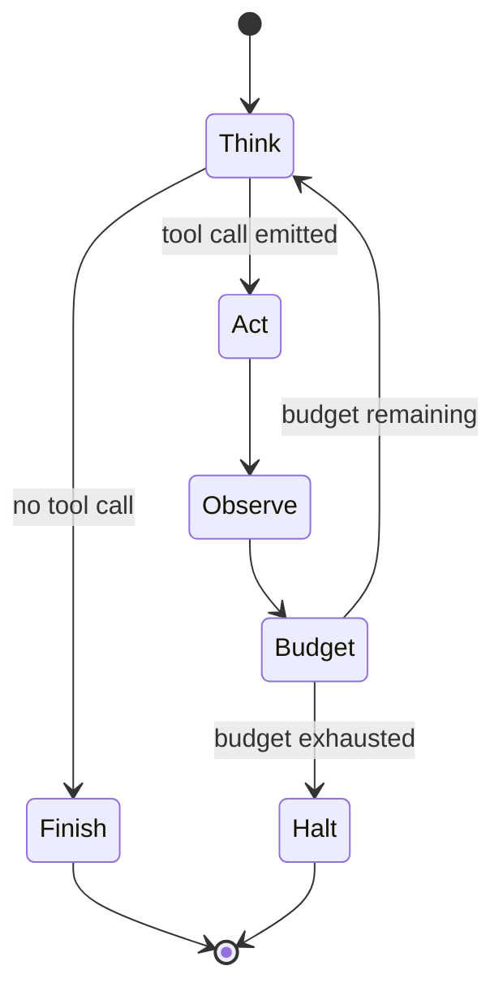

# The Agent Loop

> Personal note.

## What is it?

The repeating cycle at the heart of every agent:

```text
think  ->  act  ->  observe  ->  think  ->  ...
```

Each pass appends to the conversation, so the context grows monotonically until
the agent finishes or something intervenes.

## Why does it matter?

Almost every agent failure I have seen is a loop failure rather than a
reasoning failure:

| Failure | What it looks like | Mitigation |
| --- | --- | --- |
| Runaway | Same action repeated forever | Step budget, loop detection |
| Context exhaustion | Crashes deep into a long task | Summarise or offload |
| Silent drift | Confidently solving the wrong problem | Restate the goal periodically |
| Tool thrash | Many calls, no progress | Fewer, better-described tools |
| Lost result | Finds the answer, then forgets it | Write findings to a file |

## How does it work?



The budget check is the part that is easy to leave out and expensive to omit.

## Example

Detecting a stuck agent by watching for repeated identical actions:

```typescript
const recent: string[] = []

function isStuck(call: ToolCall): boolean {
  const signature = `${call.name}:${JSON.stringify(call.arguments)}`
  recent.push(signature)
  if (recent.length > STUCK_WINDOW) recent.shift()

  // The same call three times in a row means it is not making progress.
  return recent.length === STUCK_WINDOW && new Set(recent).size === 1
}
```

## My understanding

The loop is where autonomy actually lives, and it is also the only place you
can put guardrails. The model cannot be trusted to stop; the loop has to stop
it. Every control I care about — budgets, approval gates, retries, logging —
is a property of the loop, not of the model.

## Questions

- Is loop detection better done on exact repeats or on semantic similarity of
  actions?
- When should the loop escalate to a human rather than halting?

## Related topics

- [What is an AI Agent?](/ai/agents/fundamentals)
- [What is an AI Harness?](/ai/agents/harness)
- [Context Window](/ai/llm/context-window)
