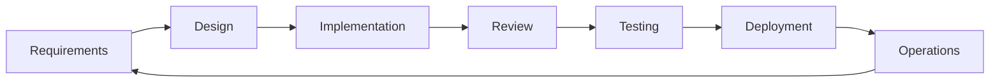

# What is Agentic SDLC?

> Personal note. This one is more opinion than knowledge so far.

## What is it?

Agentic SDLC is the idea that agents belong at every stage of the software
development lifecycle — requirements, design, implementation, review, testing,
documentation, operations — rather than only at the "write the code" step.

The distinction I care about: an AI coding assistant speeds up one activity.
An agentic SDLC changes how the work flows between activities.

## Why does it matter?

Because code generation was never the bottleneck. Understanding the
requirement, agreeing the design, reviewing the change and keeping the
documentation honest all take longer than typing the implementation. Speeding
up only the typing moves the queue somewhere else.

## How does it work?



Stage by stage, what an agent can plausibly contribute today:

| Stage | Agent contribution | My confidence |
| --- | --- | --- |
| Requirements | Draft acceptance criteria, find ambiguity | Medium |
| Design | Propose options, list trade-offs | Medium |
| Implementation | Write the change, run the tests | High |
| Review | First-pass review before a human looks | High |
| Testing | Generate cases, especially edge cases | Medium |
| Documentation | Keep docs in step with the code | High |
| Operations | Triage alerts, summarise incidents | Low, so far |

The confidence column is my own and will change.

## Example

The workflow I am converging on for a single change:

```text
1. Human writes the intent in a Markdown file
2. Agent drafts a plan; human edits the plan, not the code
3. Agent implements against the agreed plan
4. Agent runs tests and self-reviews
5. Human reviews the diff and the plan side by side
6. Agent updates the documentation in the same commit
```

Step 2 is doing most of the work. Reviewing a plan is far cheaper than
reviewing a large diff, and mistakes are cheaper to fix there.

## My understanding

The constraint is not agent capability, it is verification. Every stage where
an agent produces output needs a way to check that output cheaply. Where a
cheap check exists — tests pass, the build is green, the type checker is
happy — agents work well. Where it does not, as in "is this the right
architecture", they produce plausible material that still costs a human full
attention to evaluate.

So the practical question for each stage is not "can an agent do this?" but
"can I verify it faster than I could do it myself?"

## Questions

- Which stage gives the largest real gain for me personally? I suspect review.
- How do you keep the plan and the implementation from silently diverging?
- What does version control look like when most commits are agent-authored?

## Related topics

- [What is an AI Agent?](/ai/agents/fundamentals)
- [What is an AI Harness?](/ai/agents/harness)
- [Agentic SDLC (project)](/projects/agentic-sdlc/)
