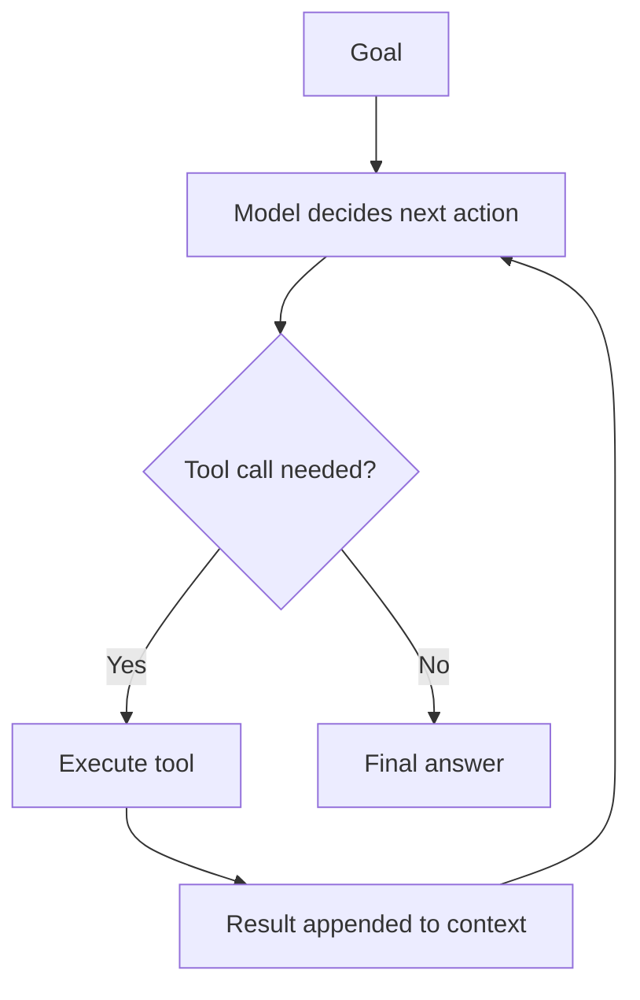

# What is an AI Agent?

> Personal note.

## What is it?

An agent is an LLM that runs in a loop with access to tools, pursuing a goal
rather than answering a single question. It decides what to do next, does it,
observes the result, and decides again — until the goal is met or it gives up.

The minimum ingredients:

| Ingredient | Role |
| --- | --- |
| Model | Decides the next action |
| Tools | Let it affect or observe the world |
| Loop | Lets it act more than once |
| Goal | Defines when to stop |
| Context | What it knows right now |

Remove the loop and you have a chatbot with function calling. Remove the tools
and you have a model talking to itself.

## Why does it matter?

Because it changes what kinds of task are automatable. A single call can
produce an answer; an agent can pursue an outcome that needs several steps and
whose path is not known upfront — read the failing test, find the cause, edit
the file, re-run, repeat.

It also changes the risk profile. Something that takes actions can take wrong
ones, repeatedly and quickly.

## How does it work?



The important detail: the model never executes anything. It emits a request to
call a tool; the surrounding program runs it and feeds the result back. That
program is the [harness](/ai/agents/harness).

## Example

Stripped to its essentials, the loop is ordinary code:

```typescript
async function runAgent(goal: string, tools: ToolRegistry): Promise<string> {
  const messages: Message[] = [{ role: 'user', content: goal }]

  for (let step = 0; step < MAX_STEPS; step++) {
    const response = await model.complete({ messages, tools: tools.definitions })
    messages.push(response.message)

    if (!response.toolCalls.length) return response.text

    for (const call of response.toolCalls) {
      const result = await tools.execute(call)
      messages.push({ role: 'tool', toolCallId: call.id, content: result })
    }
  }

  throw new Error('Agent exceeded step budget without finishing.')
}
```

Notice how much of it is bookkeeping rather than intelligence.

## My understanding

The interesting engineering is not the model, it is everything around it:
which tools exist, how their results are summarised back into the context, what
the step budget is, what happens on failure, and how the context is kept from
filling up with tool noise.

An agent is mostly a context management problem wearing a trench coat.

## Questions

- How do I decide between one agent with many tools and several specialised
  agents?
- What is a sensible default step budget before a human should be asked?

## Related topics

- [The Agent Loop](/ai/agents/agent-loop)
- [What is an AI Harness?](/ai/agents/harness)
- [Memory](/ai/agents/memory)
- [What is MCP?](/ai/mcp/)
