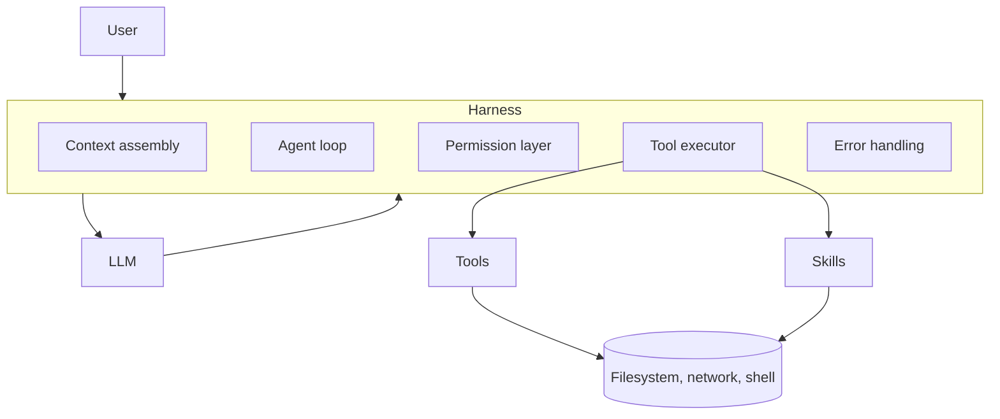

# What is an AI Harness?

> Personal note.

## What is it?

The harness is the program around the model. The model produces text; the
harness does everything else — runs the loop, executes tool calls, manages the
context, enforces permissions, handles errors, and decides when to stop.

Claude Code, OpenHands and Cursor are all harnesses. They can point at the same
underlying model and still behave completely differently, because the
difference between them is harness design.

## Why does it matter?

This was the idea that reorganised how I think about the whole field. Once you
separate model from harness, a lot of confusing observations resolve:

- The same model feels capable in one tool and useless in another.
- Upgrading the model improves things less than expected.
- Most of what people call "prompt engineering" is really harness behaviour.

Capability is a property of the pair, not of the model alone.

## How does it work?



Responsibilities worth naming separately:

| Responsibility | What it decides |
| --- | --- |
| Context assembly | What the model sees on each call |
| Tool execution | What the agent can actually do |
| Permissions | What needs human approval first |
| Error handling | Whether a failed tool call is fatal or retried |
| Termination | Step budgets, stop conditions, escalation |
| Observability | Whether you can tell what happened afterwards |

## Example

The permission layer is the piece I underrated. Conceptually:

```typescript
type Decision = 'allow' | 'deny' | 'ask'

/** Consulted before every tool call the model requests. */
function authorise(call: ToolCall): Decision {
  if (READ_ONLY_TOOLS.has(call.name)) return 'allow'
  if (call.name === 'bash' && isDestructive(call.arguments.command)) return 'ask'
  if (call.name === 'write' && isOutsideWorkspace(call.arguments.path)) return 'deny'
  return 'ask'
}
```

Without this the agent is only as safe as its best guess. With it, safety is a
property of the system rather than of the model behaving well.

## My understanding

If I want a better agent, changing the model is usually the smallest available
lever. The larger ones are: give it better tools, feed it better context, and
make its failures recoverable. All three are harness work.

Also: [Skills](/ai/skills/fundamentals) are how you extend a harness without
modifying it, which is why they are interesting for
[SkillHub](/projects/skillhub/basic).

## Questions

- Where should the line sit between harness-provided tools and MCP-provided
  tools?
- How much harness behaviour should be configurable by the user versus fixed?

## Related topics

- [What is an AI Agent?](/ai/agents/fundamentals)
- [The Agent Loop](/ai/agents/agent-loop)
- [What are Agent Skills?](/ai/skills/fundamentals)
- [What is MCP?](/ai/mcp/)
- [Claude Code](/tools/claude-code)
