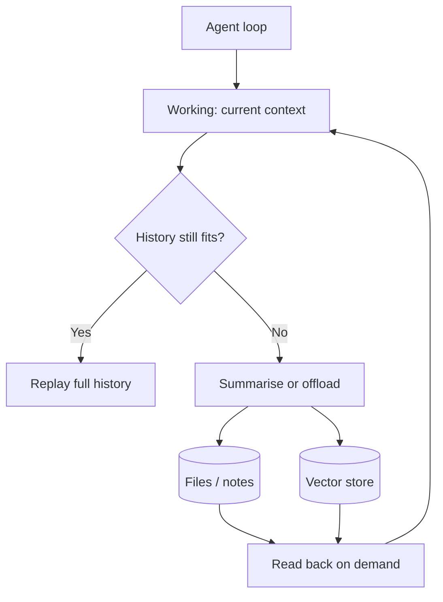

# Memory

> Personal note.

## What is it?

Models are stateless. Every apparent memory an agent has is something the
harness reconstructs and re-sends. "Memory" is therefore a design decision, not
a model feature.

The layers I distinguish:

| Layer | Lifetime | Mechanism |
| --- | --- | --- |
| Working | One loop iteration | The context window itself |
| Session | One task | Full message history, replayed each call |
| Persistent | Across sessions | Files, a database, or a vector store |
| Semantic | Across sessions, by meaning | [Embeddings](/ai/embeddings/) plus retrieval |

## Why does it matter?

Session memory is bounded by the [context window](/ai/llm/context-window), so
any long-running agent needs something beyond it. Choosing the wrong layer
shows up as either an agent that forgets what it did an hour ago, or one that
drowns in irrelevant recall.

## How does it work?



## Example

The cheapest persistent memory is a file the agent maintains itself:

```markdown
<!-- .agent/notes.md, rewritten by the agent as it works -->
## Goal
Migrate the auth module off the deprecated session API.

## Done
- Mapped all 14 call sites (see call-sites.txt)
- Migrated src/auth/login.ts

## Next
- src/auth/refresh.ts has a circular import; untangle first
```

Unglamorous, but it survives a crash, it is reviewable by a human, and it costs
nothing to implement.

## My understanding

I keep reaching for a vector store too early. For most agent work, files plus
a good directory structure are enough, and they have a property embeddings do
not: I can read them. Semantic memory earns its place when recall needs to
cross many sessions and exact paths are unknown — not before.

## Questions

- What is the right trigger for compacting session history: token threshold,
  step count, or task boundary?
- How do I stop persistent memory from accumulating stale facts?

## Related topics

- [The Agent Loop](/ai/agents/agent-loop)
- [Context Engineering](/ai/context-engineering/)
- [Embeddings](/ai/embeddings/)
