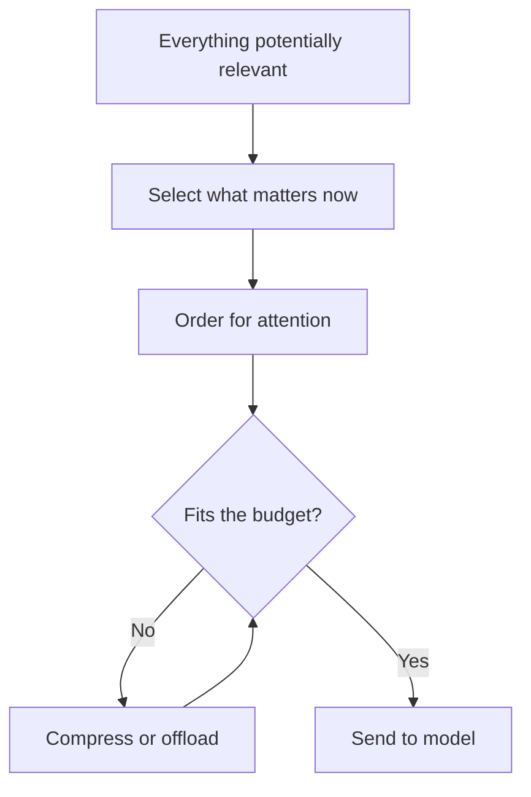

# Context Engineering

> Personal note.

## What is it?

The practice of deciding what occupies the [context window](/ai/llm/context-window)
at each step: which instructions, which history, which retrieved material,
which tool definitions — and, just as importantly, what to leave out.

Prompt engineering is about wording one message. Context engineering is about
managing the whole payload over a long-running session.

## Why does it matter?

Because context is a fixed budget and everything competes for it. In an agent
session the history grows on its own, so without deliberate management the
useful material gets crowded out by tool-call noise.

The distinction that made it click for me:

| | Prompt engineering | Context engineering |
| --- | --- | --- |
| Unit | One message | The whole window |
| Timescale | Single call | A whole session |
| Question | How do I phrase this? | What deserves the space? |
| Failure | A poor answer | Drift, exhaustion, forgetting |

## How does it work?

The levers, roughly in the order I reach for them:

1. **Select** — retrieve only what is relevant ([RAG](/ai/rag/)) rather than
   pasting everything.
2. **Compress** — summarise old turns once they stop being load-bearing.
3. **Offload** — write findings to files and read them back on demand; see
   [Memory](/ai/agents/memory).
4. **Order** — put the most important material at the start or the end, not
   buried in the middle.
5. **Isolate** — give a subtask its own fresh context and return only the
   conclusion.



## Example

Isolation in practice. A search that would otherwise dump fifty files into the
main context becomes:

```text
Main agent context
  └── subagent: "find every call site of the deprecated API"
        (reads 50 files in its own context)
        └── returns: a 12-line list of file:line references
```

The main context grows by twelve lines instead of fifty files. The reading
still happened; the noise did not survive it.

## My understanding

More context is not better context. The instinct to include everything "just
in case" is the main thing I have had to unlearn — it costs money, it slows
the call down, and it measurably degrades the answer by diluting what matters.

Working rule: every token in the window should be earning its place for the
*current* step.

## Questions

- How do I decide when to summarise rather than truncate? Is there a signal
  better than a token threshold?
- Does reordering context by relevance actually help, or is the recency effect
  strong enough that only the tail matters?

## Related topics

- [Context Window](/ai/llm/context-window)
- [Memory](/ai/agents/memory)
- [What is RAG?](/ai/rag/)
- [The Agent Loop](/ai/agents/agent-loop)
