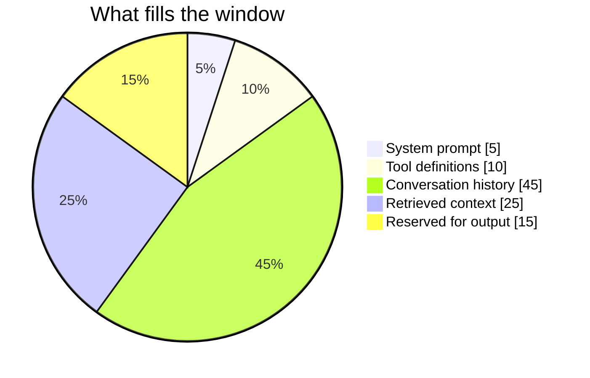
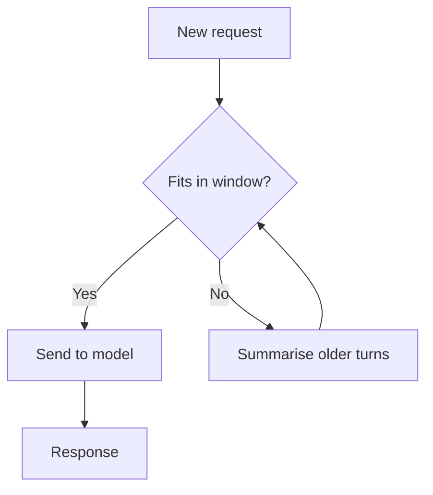

# Context Window

> Personal note.

## What is it?

The context window is the maximum number of [tokens](/ai/llm/tokens) a model
can attend to in a single call. It holds everything: the system prompt, tool
definitions, the full conversation history, retrieved documents, and the space
reserved for the response.

It is the model's entire working memory. Nothing outside it exists.

## Why does it matter?

Because it is a hard budget that several things compete for. Grow one and you
shrink another. A long agent session eats the window with tool-call history; a
large retrieved document eats it with source material.

## How does it work?

When the window is exceeded the request fails outright — the model does not
silently drop the oldest messages. Handling that is the caller's job, and the
usual strategies are:

| Strategy | Trade-off |
| --- | --- |
| Truncate oldest messages | Simple; loses early context silently |
| Summarise history | Keeps the gist; costs a call, loses detail |
| Retrieve on demand ([RAG](/ai/rag/)) | Scales past the window; adds retrieval failure modes |
| Offload to files | Cheap and durable; the agent must read back |

A separate issue is that quality degrades before the limit is reached.
Information in the middle of a very long context tends to be used less
reliably than information at the start or the end, so it fitting is not the
same as it being used.

## Example

## My understanding

I used to treat a bigger context window as straightforwardly better. It is not
— it is a bigger budget for a problem that still needs managing. Deciding what
deserves the space is the actual skill, which is why
[Context Engineering](/ai/context-engineering/) is a topic in its own right
rather than a footnote.

## Questions

- At what fill percentage does quality start to drop noticeably for the models
  I use? Worth measuring rather than guessing.
- Is summarising history better or worse than aggressive truncation for long
  coding sessions?

## Related topics

- [Tokens](/ai/llm/tokens)
- [Context Engineering](/ai/context-engineering/)
- [What is RAG?](/ai/rag/)
