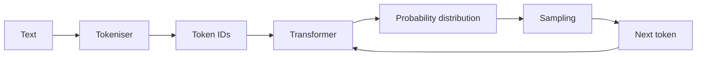

# What is an LLM?

> Personal note. This is my own understanding, written to check that I actually
> have one.

## What is it?

A large language model is a neural network trained to predict the next token in
a sequence. That is genuinely all it does at inference time: given the tokens so
far, produce a probability distribution over what comes next, sample one, append
it, repeat.

Everything else — answering questions, writing code, following instructions — is
a consequence of that objective applied to a very large amount of text, plus
post-training that shapes which continuations the model prefers.

## Why does it matter?

Because the mental model changes how you use it. If you think of an LLM as a
database, you will be surprised when it invents a citation. If you think of it
as a next-token predictor conditioned on its context, that behaviour is
expected — it produced a plausible continuation, which is what it was asked to
do.

Practical consequences:

- Anything not in the context window is recalled from training, approximately.
- The prompt is not an instruction to a program; it is a conditioning signal.
- Output quality depends heavily on what you put in front of it. See
  [Context Engineering](/ai/context-engineering/).

## How does it work?



The loop runs once per output token, which is why generation cost scales with
output length and why streaming exists.

Two parameters I actually change:

| Parameter | Effect |
| --- | --- |
| `temperature` | Flattens or sharpens the distribution. Low means predictable. |
| `max_tokens` | Hard cap on the output. Hitting it truncates mid-sentence. |

## Example

A minimal call, to keep the shape in mind:

```python
response = client.messages.create(
    model="claude-sonnet-5",
    max_tokens=1024,
    messages=[{"role": "user", "content": "Explain tokenisation in two sentences."}],
)
print(response.content[0].text)
```

There is no state on the server between calls. A conversation is the whole
message history being re-sent each time.

## My understanding

The single most useful reframe for me: the model has no memory and no tools by
default. Every apparent capability beyond text completion is something the
surrounding system provides — history is re-sent, tools are described in the
prompt and executed by the caller, retrieval is done before the call. That
surrounding system is the [harness](/ai/agents/harness).

## Questions

- How much does post-training change the next-token-predictor framing in
  practice? At what point does it stop being a useful model?
- Where exactly does the quality cliff sit as context fills up?

## Related topics

- [Tokens](/ai/llm/tokens)
- [Context Window](/ai/llm/context-window)
- [What is an AI Agent?](/ai/agents/fundamentals)
