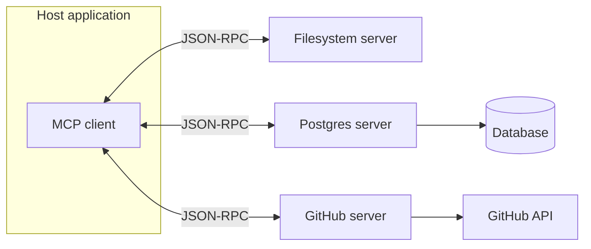

# What is MCP?

> Personal note.

## What is it?

The Model Context Protocol is an open standard for connecting AI applications
to external tools and data sources. An MCP **server** exposes capabilities; an
MCP **client** — usually a harness like Claude Code — consumes them.

The point is that the server is written once and works with any client that
speaks the protocol.

## Why does it matter?

It removes an N-times-M problem. Without a standard, every tool needs a custom
integration for every harness. With one, a Postgres MCP server works in every
client that supports MCP.

For me the practical effect is that adding a capability to an agent is a
configuration change rather than a code change.

## How does it work?

A server can expose three kinds of thing:

| Primitive | What it is | Controlled by |
| --- | --- | --- |
| Tools | Actions the model can invoke | The model |
| Resources | Data the client can read | The application |
| Prompts | Reusable prompt templates | The user |

Communication is JSON-RPC, over stdio for local servers or HTTP for remote
ones.



## Example

Configuring a server is usually just a block of JSON:

```json
{
  "mcpServers": {
    "postgres": {
      "command": "npx",
      "args": ["-y", "@modelcontextprotocol/server-postgres"],
      "env": {
        "DATABASE_URL": "postgresql://localhost:5432/mydb"
      }
    }
  }
}
```

After that the agent can query the database without anyone writing an
integration.

## My understanding

MCP is plumbing, and that is a compliment. It does not make agents smarter; it
makes their capabilities portable and composable.

Two things I had to work out:

1. **Tools versus resources.** Tools are for the model to call. Resources are
   for the application to pull in. Confusing them leads to servers that expose
   everything as a tool and flood the context with definitions.
2. **It is not free.** Every connected server adds tool definitions to the
   context window. Ten servers is a real cost, so connect what you need.

## Questions

- Where is the boundary between an MCP server and a
  [skill](/ai/skills/fundamentals)? My current answer: MCP gives new
  capabilities, skills give procedures using existing ones.
- How should authentication work for remote servers in practice?

## Related topics

- [What is an AI Agent?](/ai/agents/fundamentals)
- [What is an AI Harness?](/ai/agents/harness)
- [MCP (tooling notes)](/tools/mcp)
- [MCP Data Analyst experiment](/experiments/mcp-data-analyst)
