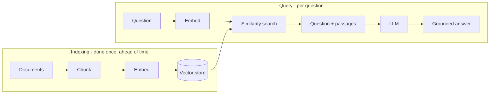

# What is RAG?

> Personal note.

## What is it?

Retrieval-Augmented Generation. Before asking the model a question, you search
your own data for relevant passages and put them into the prompt. The model
answers from that material rather than from memory.

The name makes it sound like a technique inside the model. It is not — it is
plumbing that happens entirely before the call.

## Why does it matter?

It solves three problems that a bare model has:

- **Staleness.** Training data has a cutoff; your documents do not.
- **Private data.** The model was never trained on your notes or your database.
- **Attribution.** You know which passages produced the answer, so you can cite
  and verify them.

## How does it work?



The two halves run at completely different times, which is easy to forget when
reading a diagram like this as a single flow.

## Example

The prompt that actually gets sent is unremarkable:

```text
Answer the question using only the context below.
If the context does not contain the answer, say so.

<context>
{{retrieved_passages}}
</context>

Question: {{question}}
```

Most of the engineering effort goes into what fills `retrieved_passages`, not
into this prompt.

## My understanding

RAG quality is retrieval quality. When a RAG system gives a bad answer, my
first instinct used to be to change the prompt or the model; it is almost
always the retrieval step instead — wrong chunk size, no reranking, or a
question phrased too differently from the source text to match.

The failure modes I have hit so far:

| Symptom | Usual cause |
| --- | --- |
| Answer misses obvious content | Chunks too small, context split apart |
| Irrelevant passages retrieved | No reranking; pure vector similarity |
| Model ignores the context | Context buried too deep in a long prompt |
| Confident but wrong | No instruction to admit missing information |

## Questions

- When is hybrid search (keyword plus vector) worth the extra complexity over
  vectors alone?
- How should I chunk Markdown specifically — by heading, or by fixed size with
  overlap?

## Related topics

- [Embeddings](/ai/embeddings/)
- [Context Engineering](/ai/context-engineering/)
- [Context Window](/ai/llm/context-window)
