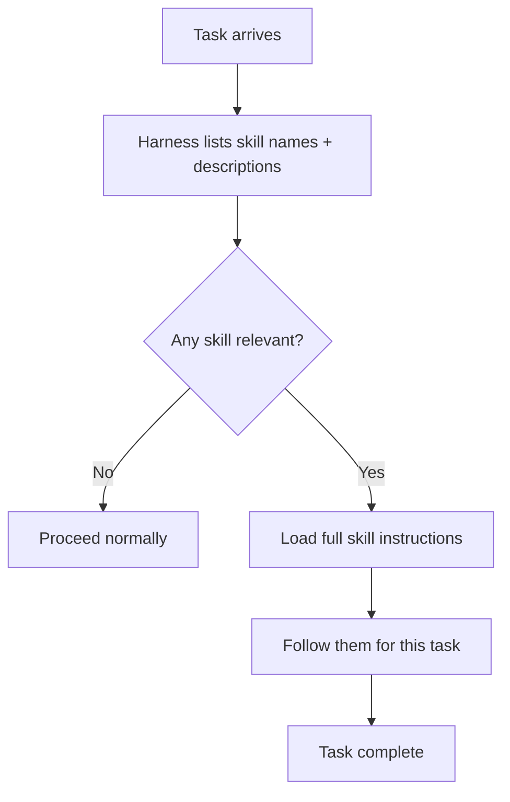

# What are Agent Skills?

> Personal note.

## What is it?

A skill is a packaged, reusable procedure an agent can load when it is
relevant. In practice it is usually a folder containing a Markdown file of
instructions, plus any scripts or reference material that go with it.

The essential parts:

| Part | Purpose |
| --- | --- |
| Name | How the skill is referred to |
| Description | How the agent decides whether it is relevant |
| Instructions | What to actually do |
| Resources | Scripts, templates, references it may use |

## Why does it matter?

Because it separates capability from the harness. Without skills, "make the
agent good at our deployment process" means changing the system prompt or
writing code. With skills, it means writing a Markdown file and dropping it in
a folder.

The property that makes them scale is progressive disclosure: only the name and
description sit in the context permanently. The full instructions load when the
skill is invoked, so a hundred available skills do not cost a hundred skills'
worth of [context window](/ai/llm/context-window).

## How does it work?



The description is the load-bearing field. If it does not say clearly when the
skill applies, the skill is never selected and might as well not exist.

## Example

A minimal skill on disk:

```text
skills/
└── release-notes/
    ├── SKILL.md          # name, description, instructions
    ├── template.md       # the output format
    └── scripts/
        └── changelog.sh  # collects merged PRs since the last tag
```

And the head of `SKILL.md`:

```markdown
---
name: release-notes
description: >
  Generate release notes from merged pull requests since the last tag.
  Use when preparing a release or when asked for a changelog.
---

# Release notes

1. Run `scripts/changelog.sh` to collect merged PRs since the last tag.
2. Group them into Added / Changed / Fixed.
3. Fill in `template.md`. Omit empty groups.
4. Flag anything that looks like a breaking change.
```

## My understanding

Skills are the closest thing agents have to functions — named, reusable,
composable units of behaviour. What makes a good one is the same thing that
makes a good function: a clear name, a precise description of when to use it,
and one job.

The mistake I keep making is writing skills that are too broad. A skill called
"help with the database" never triggers reliably. One called "restore a
Postgres backup into the local dev environment" does.

## Questions

- How specific is too specific? Where is the point at which you have too many
  skills to manage?
- How should skills be versioned when they encode a process that changes?

## Related topics

- [Skill Management](/ai/skills/skill-management)
- [SkillHub](/ai/skills/skillhub)
- [What is an AI Harness?](/ai/agents/harness)
- [What is MCP?](/ai/mcp/)
