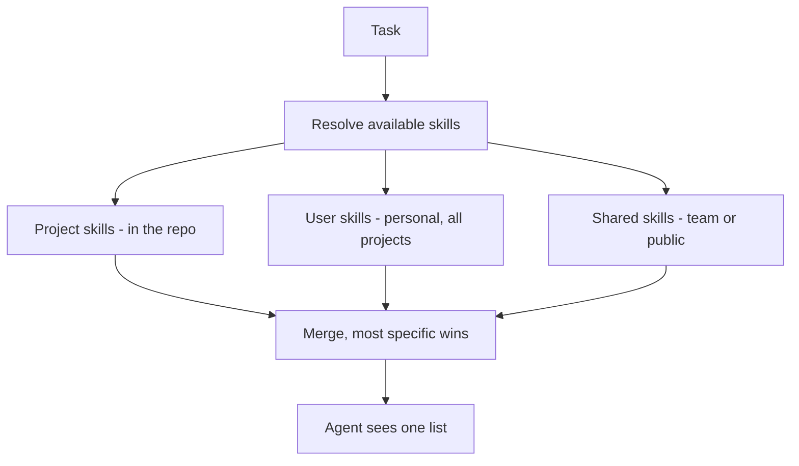

# Skill Management

> Personal note. Working through the problem rather than reporting a solution.

## What is it?

Everything that becomes necessary once skills stop being a handful of files:
where they live, how they are named, how they are versioned, how they are
shared between people and projects, and how you know which ones are still
worth keeping.

## Why does it matter?

Skills have the same lifecycle problem as any other code, but none of the
tooling. There is no package manager, no dependency resolution, no test suite,
no deprecation path. With five skills that does not matter. With fifty it does.

Specific problems I have already hit:

| Problem | Symptom |
| --- | --- |
| Discovery | I forget a skill exists and do the task manually |
| Duplication | Two skills that overlap; the wrong one triggers |
| Drift | The skill describes a process we changed months ago |
| Scope | Personal, project and team skills mixed together |
| Trust | No idea whether a shared skill is safe to run |

## How does it work?

The scoping model that seems right, borrowed from how config files usually
resolve:



Most specific wins, so a project can override a team skill without a fork.

## Example

A layout that keeps the scopes visibly separate:

```text
~/.agent/skills/            # personal, available everywhere
  code-review/
  release-notes/

<repo>/.agent/skills/       # project-specific, committed
  deploy-staging/
  seed-test-data/

<shared registry>           # team or public, pulled in
  postgres-restore/
```

## My understanding

The hard part is not storage, it is curation. A skill that is subtly out of
date is worse than no skill, because the agent follows it confidently. So
whatever I build needs to make staleness visible — when was this last used,
when was it last edited, did it succeed.


## Questions

- Should skills be versioned independently, or pinned to the repo they live in?
- What is the minimum metadata needed to make a shared skill trustworthy?
- Can a skill be tested? What would a test even assert?

## Related topics

- [What are Agent Skills?](/ai/skills/fundamentals)
- [SkillHub](/ai/skills/skillhub)
