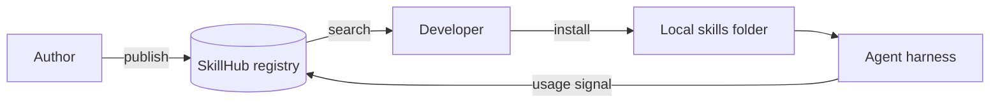

# SkillHub (concept)

> Personal note. This page is the *idea*; the build log lives in
> [Projects > SkillHub](/projects/skillhub/basic).

## What is it?

A registry for agent skills — somewhere to publish a skill, find one someone
else wrote, install it into a project or a personal scope, and see whether it
is still maintained.

Roughly what npm is for packages, but for the Markdown-and-scripts bundles
described in [What are Agent Skills?](/ai/skills/fundamentals).

## Why does it matter?

Right now skills spread by being copied. That works for one person and stops
working immediately after. There is no way to answer:

- Does a skill for this already exist?
- Is the copy I have the current one?
- Who wrote this, and does it do anything destructive?

## How does it work?



The feedback edge is the one I think matters most and that package registries
mostly lack: knowing a skill was invoked and whether the task then succeeded is
a far better quality signal than a download count.

## Example

The install experience I want:

```bash
skillhub search postgres
skillhub install postgres-restore --scope project
skillhub list --stale        # skills unused or unedited for 6 months
```

## My understanding

The registry is the easy part. The valuable and difficult parts are:

1. **Trust.** A skill can instruct an agent to run arbitrary commands. That is
   a supply-chain surface, and it needs to be treated like one — provenance,
   review, and a clear statement of what a skill touches.
2. **Curation.** See [Skill Management](/ai/skills/skill-management). Stale
   skills are actively harmful.
3. **Description quality.** A skill nobody can find is not in the registry in
   any meaningful sense.

## Questions

- Does this need a server at all, or is a Git repository with a manifest
  enough for V1?
- How do you sandbox or at least declare what a skill is allowed to touch?

## Related topics

- [What are Agent Skills?](/ai/skills/fundamentals)
- [Skill Management](/ai/skills/skill-management)
- [SkillHub (project)](/projects/skillhub/basic)
