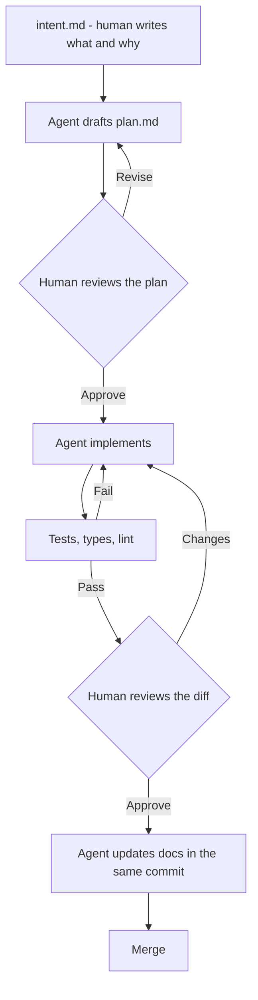

# Agentic SDLC

> Personal project notes. The concept write-up is in
> [AI > Agents > Agentic SDLC](/ai/agents/agentic-sdlc); this page tracks what
> I am actually adopting.

## Goal

Work out, from practice rather than opinion, which stages of my own
development process genuinely improve with an agent — and build the small
amount of tooling that makes those stages repeatable.

## Problem

The usual framing is "AI writes the code", which is the least interesting
version of the idea. Typing was never the slow part. The slow parts are
deciding what to build, agreeing how, reviewing the result, and keeping the
documentation honest afterwards.

Making implementation faster without touching those just moves the queue.

## Architecture

Not software — a workflow, with artefacts between stages:

The load-bearing idea is that **the plan is the review artefact**, not the
diff. Catching a wrong approach in a 30-line plan costs minutes; catching it in
a 600-line diff costs an afternoon.

## Current progress

| Stage | What I am doing | Working? |
| --- | --- | --- |
| Intent | Writing `intent.md` by hand before starting | Yes |
| Plan | Agent drafts, I edit | Yes — biggest single gain |
| Implementation | Agent implements against the plan | Yes |
| Verification | Tests and types as the gate | Yes |
| Review | Agent first pass, then me | Partly |
| Documentation | Same commit as the change | Inconsistent |
| Operations | Nothing yet | No |

## Decisions

- **Plan before code, always.** The single change that has made the most
  difference. See the same conclusion arrived at empirically in
  [OpenHands POC](/experiments/openhands-poc).
- **Verification gates every stage.** If a stage has no cheap check, an agent
  does not own it. This is the rule that decides what to automate.
- **Documentation in the same commit.** Otherwise it never happens.
- **Human approves the plan and the diff.** Two gates, both cheap. Not
  negotiable for anything that ships.
- **Project context lives in the repository.** Conventions an agent needs are
  committed, not held in my head or in a chat history.

## Open questions

- **Plan drift.** The implementation quietly diverges from the approved plan
  and nobody notices until review. Should the diff be checked against the
  plan automatically?
- **Review.** An agent reviewing agent-written code shares the blind spots.
  Does a different model help, or is that wishful?
- **Where does this stop?** Operations feels premature. Requirements feels
  like it needs a human more than anything else does.
- **Measurement.** I believe the plan step helps. I have not measured it, and
  I should be suspicious of that.

## Next steps

1. Write the intent and plan templates down as
   [skills](/ai/skills/fundamentals) rather than retyping them.
2. Try automatic plan-versus-diff checking for one week.
3. Keep a log of where the process failed — that log is the real research.
4. Find one cheap measurement for the plan-first claim.

## Related topics

- [What is Agentic SDLC?](/ai/agents/agentic-sdlc)
- [What is an AI Harness?](/ai/agents/harness)
- [Claude Code](/tools/claude-code)
- [SkillHub](/projects/skillhub/basic)
